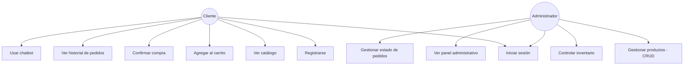

# Especificación de Requerimientos de Software (ERS)
## Proyecto: FarmaVida — Sistema de información empresarial para farmacia online

**Asignatura:** Desarrollo de Aplicaciones Empresariales
**Fase del ciclo de vida:** 00 — Ingeniería de Requerimientos
**Versión:** 1.1

---

## 1. Introducción

### 1.1 Propósito
Especificar los requerimientos funcionales y no funcionales de **FarmaVida**, que evoluciona de una tienda web simple a un sistema de información empresarial con usuarios, roles, inventario y pedidos.

### 1.2 Alcance
El cliente podrá registrarse, ver el catálogo, comprar y consultar su historial. El administrador podrá gestionar el catálogo, el inventario y los pedidos, y consultar reportes del negocio. La interfaz será bilingüe (español/inglés).

**Fuera de alcance:** pasarela de pago real, correos transaccionales automáticos, app móvil nativa.

### 1.3 Definiciones y acrónimos
| Término | Definición |
|---|---|
| CRUD | Crear, Consultar, Actualizar, Eliminar |
| RF / RNF | Requerimiento Funcional / No Funcional |
| EPS | Entidad Promotora de Salud (afiliación médica en Colombia) |

### 1.4 Referencias
Guía de actividad "Desarrollo de Aplicaciones Empresariales – Sexto Semestre"; Ley 1581 de 2012 (protección de datos, Colombia).

---

## 2. Descripción general

- **Perspectiva del producto:** aplicación web independiente, arquitectura de tres capas (Frontend → Backend/API en PHP → Base de datos MySQL).
- **Roles:** **Cliente** (compra y gestiona su cuenta) y **Administrador** (gestiona catálogo, inventario y reportes).
- **Restricciones:** debe usar PHP + MySQL; las contraseñas se almacenan cifradas; los datos de salud requieren consentimiento explícito (Ley 1581 de 2012).
- **Supuestos:** entorno local tipo XAMPP durante el desarrollo académico; una sola moneda (COP).

---

## 3. Levantamiento de requerimientos (entrevista simulada con el cliente)

Se simuló una reunión con el **cliente** (dueño de la farmacia) para validar necesidades reales antes de definir los requerimientos:

- *"Llevo el inventario y las ventas a mano; quiero que los clientes compren en línea y yo controle qué hay disponible."*
- *"Solo yo, o quien yo autorice como administrador, debe poder modificar el catálogo."*
- *"No debería venderse más de lo que tengo en existencia, y quiero que me avise cuando algo se esté agotando."*
- *"Los datos de contacto son necesarios, pero los de salud son sensibles y deben pedirse con cuidado."*
- *"Quiero ver cuántos clientes y pedidos tengo, y cómo ha sido la atención del chat."*

De estas respuestas se derivan directamente los requerimientos de la sección 4.

---

## 4. Requerimientos específicos

### 4.1 Requerimientos funcionales

| ID | Requerimiento | Actor | Prioridad |
|---|---|---|---|
| RF-01 | Registro de nuevos clientes. | Cliente | Alta |
| RF-02 | Inicio y cierre de sesión, validando credenciales. | Cliente, Admin | Alta |
| RF-03 | Contraseñas almacenadas cifradas (hash), nunca en texto plano. | Sistema | Alta |
| RF-04 | Mínimo dos roles (Cliente, Administrador), con funciones restringidas por rol. | Sistema | Alta |
| RF-05 | CRUD de productos (crear, consultar, editar, eliminar/desactivar). | Admin | Alta |
| RF-06 | Los productos provienen de la base de datos, no están escritos en el HTML. | Sistema | Alta |
| RF-07 | Cada producto tiene: id, nombre, descripción, categoría, precio, imagen, cantidad disponible, estado. | Sistema | Alta |
| RF-08 | No se permite comprar más unidades de las disponibles en inventario. | Sistema | Alta |
| RF-09 | Alerta cuando un producto llega a un nivel mínimo de existencias. | Sistema | Media |
| RF-10 | El inventario se actualiza automáticamente al generarse un pedido. | Sistema | Alta |
| RF-11 | Agregar al carrito, modificar cantidades y eliminar productos. | Cliente | Alta |
| RF-12 | Cálculo de subtotal y total del carrito. | Sistema | Alta |
| RF-13 | Confirmar compra y generar un pedido asociado al cliente. | Cliente | Alta |
| RF-14 | Consultar historial de pedidos propio. | Cliente | Media |
| RF-15 | Consultar todos los pedidos y cambiar su estado. | Admin | Media |
| RF-16 | Panel con: usuarios, productos, inventario bajo, pedidos y su estado. | Admin | Media |
| RF-17 | Chatbot de atención al cliente. | Cliente | Baja |
| RF-18 | Interfaz disponible en español e inglés. | Sistema | Media |

### 4.2 Requerimientos no funcionales

| ID | Requerimiento | Categoría |
|---|---|---|
| RNF-01 | Validación de todos los datos ingresados antes de procesarlos. | Confiabilidad |
| RNF-02 | Datos sensibles (salud) solo se recolectan con consentimiento explícito. | Seguridad / Legal |
| RNF-03 | Interfaz responsiva (móvil y escritorio). | Usabilidad |
| RNF-04 | Errores manejados de forma clara, sin exponer detalles técnicos sensibles. | Seguridad |
| RNF-05 | Operaciones CRUD con respuesta menor a 3 segundos en condiciones normales. | Rendimiento |
| RNF-06 | Código organizado separando lógica de negocio y presentación. | Mantenibilidad |

---

## 5. Actores del sistema

- **Cliente:** compra productos y gestiona su cuenta.
- **Administrador:** gestiona catálogo, inventario y reportes.
- **Chatbot:** resuelve preguntas frecuentes de forma automática.

---

## 6. Diagrama de casos de uso

> Los diagramas de flujo de procesos y de contexto del sistema se desarrollan en la fase **01-análisis**, junto con el modelo de datos.

---

## 7. Conclusión

FarmaVida debe evolucionar de una tienda simple a un sistema con roles, inventario y trazabilidad de pedidos, manteniendo el manejo responsable de datos de salud conforme a la Ley 1581 de 2012. Esta especificación es la base de la fase **01-análisis**.
