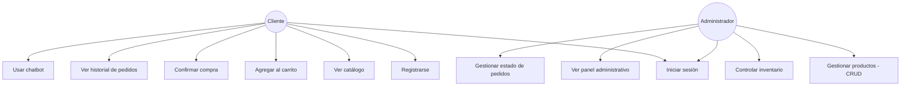
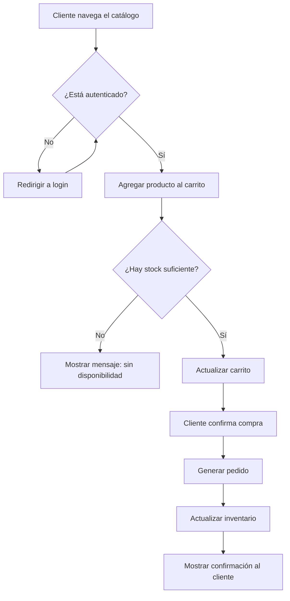
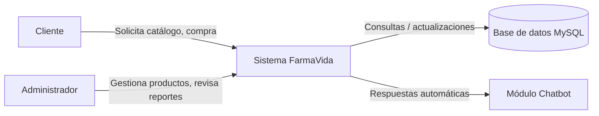

# Especificación de Requerimientos de Software (ERS)
## Proyecto: FarmaVida — Sistema de información empresarial para farmacia online

**Asignatura:** Desarrollo de Aplicaciones Empresariales
**Fase del ciclo de vida:** 00 — Ingeniería de Requerimientos
**Versión:** 1.0

---

## 1. Introducción

### 1.1 Propósito
Este documento especifica los requerimientos funcionales y no funcionales del sistema **FarmaVida**, una aplicación web para la venta de productos farmacéuticos, que evoluciona de una tienda web simple hacia un sistema de información empresarial con gestión de usuarios, roles, inventario y pedidos.

### 1.2 Alcance
El sistema permitirá a los clientes registrarse, consultar el catálogo de productos, agregarlos a un carrito y confirmar compras. Los administradores podrán gestionar el catálogo (crear, editar, eliminar productos), controlar el inventario y consultar reportes del negocio (usuarios, pedidos, conversaciones del chatbot de atención al cliente). El sistema debe operar en español e inglés.

**Queda fuera del alcance** de esta versión: pasarelas de pago reales (se simula la confirmación de compra), envío de correos transaccionales automáticos, y aplicación móvil nativa.

### 1.3 Definiciones, acrónimos y abreviaturas
| Término | Definición |
|---|---|
| CRUD | Crear, Consultar (Read), Actualizar, Eliminar |
| ERS | Especificación de Requerimientos de Software |
| RF | Requerimiento Funcional |
| RNF | Requerimiento No Funcional |
| EPS | Entidad Promotora de Salud (afiliación médica del cliente en Colombia) |

### 1.4 Referencias
- Guía de actividad "Desarrollo de Aplicaciones Empresariales – Sexto Semestre" (documento de la asignatura).
- Ley 1581 de 2012 (Protección de datos personales, Colombia).

---

## 2. Descripción general

### 2.1 Perspectiva del producto
FarmaVida es un sistema web independiente (no se integra con sistemas externos existentes). Sigue una arquitectura de tres capas: **Frontend (HTML/CSS/JS) → Backend/API (PHP) → Base de datos (MySQL)**.

### 2.2 Funciones del producto (resumen)
- Registro, inicio y cierre de sesión de usuarios (clientes y administradores).
- Gestión de catálogo de productos (CRUD) desde un panel administrativo.
- Carrito de compras y generación de pedidos.
- Control de inventario ligado a los pedidos.
- Panel administrativo con indicadores del negocio.
- Chatbot de atención al cliente con calificación del servicio.
- Soporte bilingüe (español/inglés).

### 2.3 Características de los usuarios / Roles
| Rol | Descripción |
|---|---|
| **Cliente** | Persona que se registra para comprar productos, gestionar su carrito y ver su historial de pedidos. |
| **Administrador** | Encargado de gestionar el catálogo, el inventario y consultar reportes del negocio. |

### 2.4 Restricciones
- El sistema debe desarrollarse en PHP + MySQL (continuidad del proyecto ya iniciado).
- Las contraseñas deben almacenarse cifradas (hash), nunca en texto plano.
- Los datos sensibles de salud del cliente requieren consentimiento explícito, conforme a la Ley 1581 de 2012.

### 2.5 Supuestos y dependencias
- Se asume que el sistema corre sobre un entorno local tipo XAMPP (Apache + MySQL) durante el desarrollo académico.
- Se asume una única moneda (COP) y una sola zona horaria.

---

## 3. Metodología de levantamiento de requerimientos

Para esta fase se simuló una reunión de levantamiento de requerimientos con el **cliente** (dueño de la farmacia), con el fin de validar necesidades reales del negocio antes de definir los requerimientos formales.

**Resumen de la entrevista simulada:**

> **Pregunta:** ¿Qué problema quiere resolver con este sistema?
> **Cliente:** Actualmente llevo el inventario y las ventas de forma manual. Quiero que los clientes puedan ver mis productos y comprar en línea, y que yo pueda controlar qué hay disponible sin perder el registro de nada.

> **Pregunta:** ¿Quién debe poder modificar el catálogo?
> **Cliente:** Solo yo o alguien de mi confianza que yo autorice como administrador. Los clientes no deben poder editar productos ni precios.

> **Pregunta:** ¿Qué pasa si un producto se agota?
> **Cliente:** No debería poder venderse más de lo que tengo en existencia, y me gustaría que el sistema me avise cuando un producto esté por agotarse.

> **Pregunta:** ¿Qué información necesita del cliente al registrarse?
> **Cliente:** Datos básicos de contacto y entrega. Algunos datos, como condiciones de salud, son sensibles, así que deben pedirse con cuidado y solo si el cliente lo autoriza.

> **Pregunta:** ¿Qué necesita ver usted como dueño del negocio?
> **Cliente:** Cuántos clientes tengo, cuántos pedidos se han hecho, qué productos se están agotando y cómo ha sido la atención del chat.

De esta entrevista se derivan directamente los requerimientos funcionales y no funcionales listados en la sección 4.

---

## 4. Requerimientos específicos

### 4.1 Requerimientos funcionales

| ID | Requerimiento | Actor | Prioridad |
|---|---|---|---|
| RF-01 | El sistema debe permitir el registro de nuevos clientes. | Cliente | Alta |
| RF-02 | El sistema debe permitir iniciar y cerrar sesión, validando credenciales. | Cliente, Administrador | Alta |
| RF-03 | Las contraseñas deben almacenarse cifradas (hash), no en texto plano. | Sistema | Alta |
| RF-04 | El sistema debe distinguir mínimo dos roles: Cliente y Administrador, restringiendo funciones administrativas al rol correspondiente. | Sistema | Alta |
| RF-05 | El administrador debe poder crear, consultar, editar y eliminar (desactivar) productos. | Administrador | Alta |
| RF-06 | Los productos deben obtenerse desde la base de datos, no estar escritos en el HTML. | Sistema | Alta |
| RF-07 | Cada producto debe tener: identificador, nombre, descripción, categoría, precio, imagen, cantidad disponible y estado. | Sistema | Alta |
| RF-08 | El sistema debe impedir que un cliente compre más unidades de las disponibles en inventario. | Sistema | Alta |
| RF-09 | El sistema debe alertar cuando un producto llegue a un nivel mínimo de existencias. | Sistema | Media |
| RF-10 | El inventario debe actualizarse automáticamente al generarse un pedido. | Sistema | Alta |
| RF-11 | El cliente debe poder agregar productos al carrito, modificar cantidades y eliminarlos. | Cliente | Alta |
| RF-12 | El sistema debe calcular subtotal y total del carrito. | Sistema | Alta |
| RF-13 | El cliente debe poder confirmar la compra, generando un pedido asociado a su cuenta. | Cliente | Alta |
| RF-14 | El cliente debe poder consultar su historial de pedidos. | Cliente | Media |
| RF-15 | El administrador debe poder consultar todos los pedidos y cambiar su estado. | Administrador | Media |
| RF-16 | El administrador debe contar con un panel con: cantidad de usuarios, cantidad de productos, productos con inventario bajo, cantidad de pedidos, últimos pedidos y su estado. | Administrador | Media |
| RF-17 | El sistema debe ofrecer un canal de atención (chatbot) para responder preguntas frecuentes del cliente. | Cliente | Baja |
| RF-18 | La interfaz debe estar disponible en español e inglés. | Sistema | Media |

### 4.2 Requerimientos no funcionales

| ID | Requerimiento | Categoría |
|---|---|---|
| RNF-01 | El sistema debe validar todos los datos ingresados por el usuario antes de procesarlos. | Confiabilidad |
| RNF-02 | Los datos sensibles (condición de salud) solo se recolectan con consentimiento explícito del cliente. | Seguridad / Legal |
| RNF-03 | La interfaz debe ser responsiva y utilizable desde dispositivos móviles y de escritorio. | Usabilidad |
| RNF-04 | El sistema debe manejar y mostrar errores de forma clara, sin exponer información técnica sensible al usuario final. | Seguridad |
| RNF-05 | El tiempo de respuesta de las operaciones CRUD no debe superar los 3 segundos bajo condiciones normales. | Rendimiento |
| RNF-06 | El código debe organizarse siguiendo buenas prácticas (separación de lógica de negocio y presentación). | Mantenibilidad |

---

## 5. Actores del sistema

- **Cliente:** usuario final que compra productos.
- **Administrador:** usuario interno que gestiona catálogo, inventario y reportes.
- **Sistema (chatbot):** actor de apoyo que resuelve preguntas frecuentes.

---

## 6. Diagramas

### 6.1 Diagrama de casos de uso

### 6.2 Diagrama de flujo — Proceso de compra

### 6.3 Diagrama de contexto del sistema

---

## 7. Conclusiones de la fase de requerimientos

El levantamiento de requerimientos confirma que el proyecto FarmaVida debe evolucionar de una tienda simple a un sistema con control de roles, inventario y trazabilidad de pedidos, manteniendo el manejo responsable de datos sensibles de salud conforme a la normativa colombiana. Estos requerimientos son la base para la siguiente fase (**01-análisis**), donde se definirá el modelo de datos y los diagramas entidad-relación.
