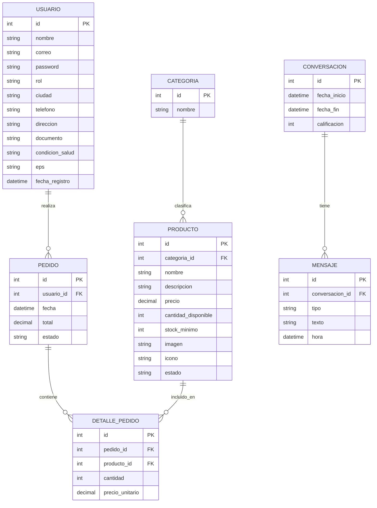

# Documento de Análisis del Sistema
## Proyecto: FarmaVida — Sistema de información empresarial para farmacia online

**Asignatura:** Desarrollo de Aplicaciones Empresariales
**Fase del ciclo de vida:** 01 — Análisis
**Versión:** 1.0
**Basado en:** `00-requerimientos/requerimientos.md`

---

## 1. Objetivo del análisis

Traducir los requerimientos funcionales y no funcionales definidos en la fase 00 en un modelo de datos y de procesos que sirva de base para el diseño (fase 02) y el desarrollo (fase 03). En particular, se evoluciona el modelo de datos actual del proyecto para incorporar una entidad independiente de **categorías** y el detalle de pedidos con **múltiples productos por pedido**, tal como lo exige la actividad.

---

## 2. Descripción detallada de casos de uso

### CU-01: Registrar cliente
- **Actor:** Cliente
- **Precondición:** El usuario no tiene una cuenta previa con el mismo correo.
- **Flujo normal:**
  1. El cliente accede al formulario de registro.
  2. Ingresa datos públicos, semiprivados, privados y (opcionalmente) sensibles.
  3. Acepta el tratamiento de datos personales.
  4. El sistema valida y crea la cuenta, cifrando la contraseña.
  5. Se inicia sesión automáticamente.
- **Flujo alterno:** Si el correo ya existe, el sistema muestra un mensaje de error y no crea la cuenta.

### CU-02: Iniciar sesión
- **Actor:** Cliente, Administrador
- **Precondición:** El usuario tiene una cuenta creada.
- **Flujo normal:** El usuario ingresa credenciales → el sistema valida contra la base de datos → si son correctas, crea la sesión y redirige según el rol.
- **Flujo alterno:** Credenciales incorrectas → se muestra mensaje de error, no se crea sesión.

### CU-03: Gestionar productos (CRUD)
- **Actor:** Administrador
- **Precondición:** El administrador tiene sesión activa.
- **Flujo normal:** El administrador crea, edita o elimina (desactiva) un producto desde el panel; el sistema valida los datos y actualiza la base de datos.
- **Regla de negocio:** Un producto eliminado no se borra físicamente, pasa a estado "inactivo" para no romper el historial de pedidos ya generados.

### CU-04: Agregar producto al carrito
- **Actor:** Cliente
- **Precondición:** Sesión de cliente activa; el producto está en estado "activo".
- **Flujo normal:** El cliente selecciona un producto → el sistema valida stock disponible → agrega el ítem al carrito de la sesión.
- **Flujo alterno:** Si no hay stock suficiente, el sistema rechaza la operación y muestra un aviso.

### CU-05: Confirmar compra
- **Actor:** Cliente
- **Precondición:** El carrito tiene al menos un producto.
- **Flujo normal:**
  1. El cliente confirma la compra.
  2. El sistema valida nuevamente el stock de cada ítem.
  3. Se genera un pedido con su detalle (uno o varios productos).
  4. Se descuenta el inventario de cada producto vendido.
  5. Se vacía el carrito y se muestra la confirmación.

### CU-06: Consultar panel administrativo
- **Actor:** Administrador
- **Flujo normal:** El sistema calcula y muestra: total de clientes, total de productos, productos con inventario bajo, total de pedidos, últimos pedidos y su estado.

---

## 3. Diccionario de datos (modelo propuesto)

### USUARIO
| Campo | Tipo | Descripción |
|---|---|---|
| id | INT (PK) | Identificador único |
| nombre | VARCHAR(150) | Nombre completo |
| correo | VARCHAR(150) | Correo, único, usado para login |
| password | VARCHAR(255) | Contraseña cifrada (hash) |
| rol | ENUM('cliente','administrador') | Define permisos del usuario |
| ciudad, telefono, direccion, documento | VARCHAR | Datos de contacto y envío |
| condicion_salud | VARCHAR (nullable) | Dato sensible, requiere consentimiento |
| eps | VARCHAR | Afiliación médica |
| fecha_registro | DATETIME | Fecha de creación de la cuenta |

> Nota de análisis: se propone **unificar** `clientes` y `administradores` en una sola entidad `USUARIO` con campo `rol`, para simplificar el modelo (alternativa aceptable: mantenerlas separadas si el equipo prefiere conservar la estructura actual; ambas opciones son válidas, documentar la decisión tomada en el diseño).

### CATEGORIA
| Campo | Tipo | Descripción |
|---|---|---|
| id | INT (PK) | Identificador único |
| nombre | VARCHAR(100) | Nombre de la categoría (ej. "Analgésicos") |

### PRODUCTO
| Campo | Tipo | Descripción |
|---|---|---|
| id | INT (PK) | Identificador único |
| categoria_id | INT (FK → CATEGORIA) | Categoría a la que pertenece |
| nombre | VARCHAR(150) | Nombre del producto |
| descripcion | VARCHAR(255) | Descripción corta |
| precio | DECIMAL(10,2) | Precio unitario |
| cantidad_disponible | INT | Stock actual |
| stock_minimo | INT | Umbral para alerta de inventario bajo |
| imagen | VARCHAR(255) | Ruta o URL de la imagen |
| icono | VARCHAR(10) | Emoji de respaldo si no hay imagen |
| estado | ENUM('activo','inactivo') | Visibilidad en el catálogo |

### PEDIDO
| Campo | Tipo | Descripción |
|---|---|---|
| id | INT (PK) | Identificador único |
| usuario_id | INT (FK → USUARIO) | Cliente que hizo el pedido |
| fecha | DATETIME | Fecha de creación |
| total | DECIMAL(10,2) | Total del pedido |
| estado | ENUM('pendiente','en proceso','entregado','cancelado') | Estado gestionado por el administrador |

### DETALLE_PEDIDO
| Campo | Tipo | Descripción |
|---|---|---|
| id | INT (PK) | Identificador único |
| pedido_id | INT (FK → PEDIDO) | Pedido al que pertenece |
| producto_id | INT (FK → PRODUCTO) | Producto comprado |
| cantidad | INT | Unidades compradas |
| precio_unitario | DECIMAL(10,2) | Precio del producto al momento de la compra |

### CONVERSACION / MENSAJE (módulo chatbot, ya existente)
Se conservan del modelo actual: `CONVERSACION(id, fecha_inicio, fecha_fin, calificacion)` y `MENSAJE(id, conversacion_id FK, tipo, texto, hora)`.

---

## 4. Diagrama entidad-relación

---

## 5. Reglas de negocio identificadas

| ID | Regla |
|---|---|
| RN-01 | No se puede confirmar un pedido si algún producto no tiene stock suficiente. |
| RN-02 | Un producto nunca se elimina físicamente; se marca como "inactivo". |
| RN-03 | El precio registrado en `DETALLE_PEDIDO` es el vigente al momento de la compra (no cambia si luego el producto sube o baja de precio). |
| RN-04 | Se genera una alerta cuando `cantidad_disponible` de un producto sea menor o igual a `stock_minimo`. |
| RN-05 | Los datos sensibles de salud del cliente solo se almacenan si hay consentimiento explícito. |

---

## 6. Matriz de trazabilidad (requerimiento → entidad/proceso)

| Requerimiento (fase 00) | Entidad / Proceso relacionado |
|---|---|
| RF-05, RF-06, RF-07 | PRODUCTO, CATEGORIA |
| RF-08, RF-09, RF-10 | PRODUCTO (cantidad_disponible, stock_minimo) |
| RF-11, RF-12, RF-13 | PEDIDO, DETALLE_PEDIDO |
| RF-14, RF-15 | PEDIDO (historial y estado) |
| RF-16 | Consultas agregadas sobre USUARIO, PRODUCTO, PEDIDO |
| RNF-02 | USUARIO (condicion_salud) |

---

## 7. Conclusión de la fase de análisis

El modelo propuesto normaliza la categoría de productos y separa el detalle de cada pedido, permitiendo que un pedido incluya múltiples productos (lo cual el modelo actual de `database.sql` no soporta). Este modelo será la base del diagrama de diseño de base de datos y de la arquitectura que se documentarán en la fase **02-diseño**.
